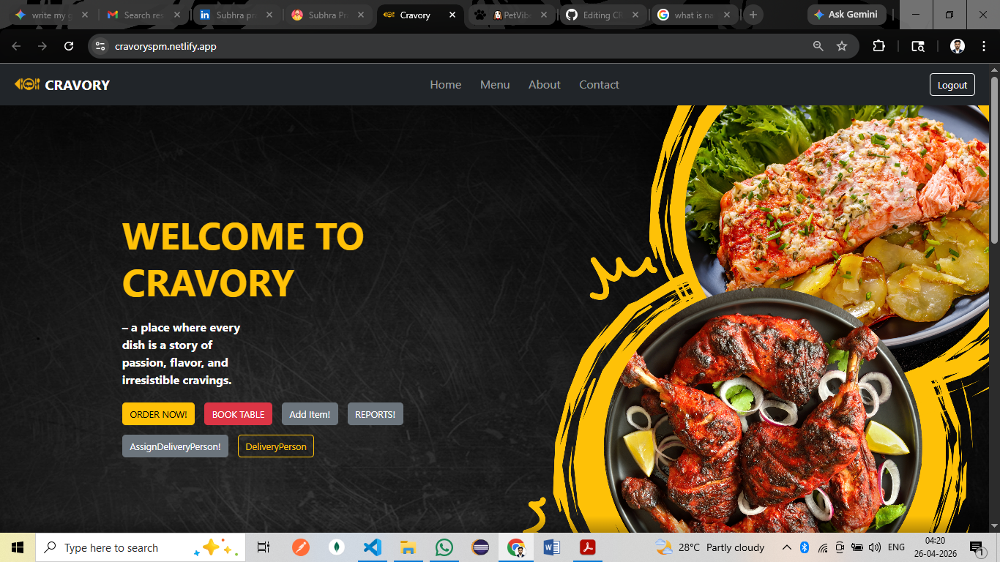

# 🍽️ Cravory - Restaurant Management Web App

Cravory is a full-stack restaurant management system built with React and Node.js using PostgreSQL as the database. It supports seamless user registration, menu item management, order placement, and PDF receipt generation with QR code.

## 🔧 Features

### 🧑 User
- 🔐 User Registration and Login
- 🧾 Place orders with item, quantity, and delivery details
- 📦 Automatically fetches user info and order number
- 📥 Download receipt as a printable PDF slip (with QR code)
- 📃 View itemized order breakdown with prices and totals

### 🧑‍🍳 Admin
- 📋 Add multiple menu items with auto-generated IDs and base64-encoded images
- 🔎 View and manage order data

## 🚀 Technologies Used

| Frontend | Backend | Database | Other |
|----------|---------|----------|-------|
| React.js | Express.js | PostgreSQL | jsPDF (for receipts) |
| Axios    | Sequelize |           | QRCode (for receipts) |
| React-Router | CORS |           | Toastify (for alerts) |

## 📸 Demo

*The PetVibe AI interface featuring the "Understand Your Dog Better" dashboard.*

## 📦 Installation

### 1. Clone the repository

git clone https://github.com/subhrapratim07/cravory.git
cd cravory

## 2. Backend Setup

- cd backend
- npm install
- node index.js

## 3. Frontend Setup

- cd frontend
- npm install
- npm run dev
